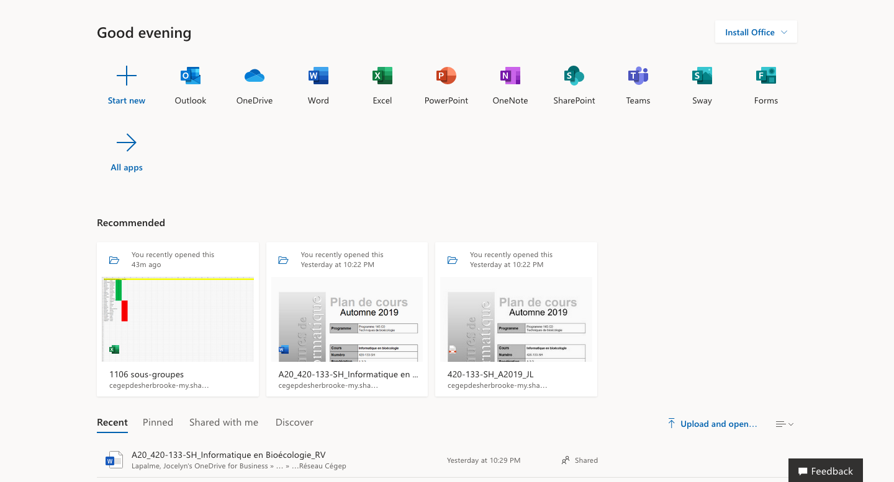

## Le Cégep _(point de vue informatique)_
Les sujets que nous allons aborder:
- **SAM, LÉA et MIO** : tous des bons amis 
- **Office 365** : quand il y a de la gratuité, il faut se gâter
- **Votre espace personnel (T:)** : Tant qu'à y être, le M:. Mais pas le C: !
- **Clef USB** : c'est délicat 
- **Impression** : quelques trucs pour garder le fil
- **Terminer une session de travail** : vous ne laisseriez pas vos portes de voiture débarrées ...
- **Remise de travaux** : nos secrets à nous
- **Ghosting** : pas si effrayant

### SAM, LÉA et MIO
Le Cégep de Sherbrooke vous offre trois plateformes principales sur lesquelles, tout au long de votre parcours à cette vénérable institution, pouvoir :
- Communiquer avec vos enseignants et vos collègues (MIO)
- Trouver et remettre tous les documents et informations relatifs à vos cours (LÉA)
- Gérer votre vie étudiante (SAM)

#### SAM
Dans l'interface de SAM, vous découvrirez une panoplie de service et d'outils auxquels vous avez accès, vous pourrez consulter votre horaire et avoir un aperçu des actualités du Cégep qui vous concernent.  Vous pourrez découvrir SAM en :
1. Naviguant jusqu'au site du [Cégep](/https://www.cegepsherbrooke.qc.ca/)
2. Cliquant sur le bouton "INTRANET" situé en haut à droit de la page d'accueil. Pour les paresseux : [https://cegepsherbrooke.omnivox.ca/](https://cegepsherbrooke.omnivox.ca/)

Si c'est votre première utilisation :
3. Cliquez sur "Première utilisation". Pour les paresseux : [https://cegepsherbrooke.omnivox.ca/intr/Module/Identification/?TypeUtilisateur=Etudiant](https://cegepsherbrooke.omnivox.ca/intr/Module/Identification/?TypeUtilisateur=Etudiant)
4. Suivez les instructions

#### LÉA
LÉA est une plateforme en ligne qui permet d'avoir une vue d'ensemble de ses cours. Vous trouverez sur cette plateforme :
- Le plan de cours
- Des documents complémentaires
- Des tutoriels
- Des examens formatifs
- Des notes de cours (quand elle ne seront pas ici)
- Votes notes d'évaluation
- Et bien d'autres choses
- Pour y accéder : le lien est trop complexe pour être collé ici. Vous pouvez accéder à LÉA en vous connectant à SAM (voir la section précédente) et en cliquant sur l'icône ayant trois petites personnes vertes en haut à gauche de l'écran.

#### MIO
MIO c'est tout simplement la plateforme de messagerie interne du Cégep de Sherbrooke. C'est par là qu'une bonne partie de vos communications passeront au courant des vos études. Pour y accéder : [https://cegepsherbrooke.omnivox.ca/intr/Module/ServicesExterne/RedirigeMio.ashx](https://cegepsherbrooke.omnivox.ca/intr/Module/ServicesExterne/RedirigeMio.ashx)

Dans le cadre de notre cours, je vous demanderai de me remettre vos travaux par un MIO avec une pièce jointe attachée.

### Office 365
C'est probablement l'ensemble d'outils que vous utiliserez le plus dans votre vie professionnelle. Ça vaut la peine de découvrir cette suite bureautique très puissante. C'est d'ailleurs ce sur quoi porte une bonne partie de ce cours donc limitons nous aux questiosn d'accès à Office 365 pour cette section.

Pour accéder à votre compte Office 365 fourni par le Cégep, voici les étapes à suivre :
- Naviguez jusqu'à [https://portal.office.com/](https://portal.office.com/)
- Votre nom d’utilisateur est votre numéro de DA suivi de « @cegepsherbrooke.qc.ca ». 
  - Ex: ```20150388@cegepsherbrooke.qc.ca```
- Votre de mot de passe est celui que vous utilisez pour vous connecter à l'ordinateur.
  - Note : **Si vous changez votre mot de passe d'ordinateur au Cégep vous modifierez votre mot de passe pour office et vice versa**



### Votre espace personnel (T:)
À chaque soir, le Cégep fait le ménage. Le balais est passé et les ordinateurs sont remis à neuf. Ce grand ménage quotidien signifie que vous ne pouvez pas laisser vos documents et données n'importe où, sous peine de perdre votre travail de la journée.

Étant donné que le Cégep imagine bien que vous ne pourrez pas finir tous vos travaux en une seule journée, un espace vous a été aménagé, le ```T:```. Pour accéder à cet espace :
- Ouvrez un explorateur de fichier
- Cliquez sur "Ce PC"
- Cliquez sur le dossier ```nomdefamillecoupeprenomcoupe (T:)```

Tous les fichiers que vous enregistrez sur le T: vous appartiennent et seront conservés à long terme. Les fichiers que vous laisserez sur le "bureau" de l'ordinateur ou sur le C: seront effacés.

Dernier emplacement réseau qui vous sera probablement utile lors de votre séjour au Cégep : le M:. C'est un endroit de partage entre les étudiants et les professeurs d'un cours spécifique. Dans votre M:, vous trouverez un dossier par cours que vous avez cette session. Dans chaque dossier de cours vous trouverez deux sous-dossiers :
- Public : c'est un dossier dans lequel les enseignants peuvent mettre des fichiers et dans lequel les étudiants peuvent copier des fichiers. Le contraire n'est pas vrai.
- Retour : c'est un dossier dans lequel les étudiants peuvent mettre des fichiers, mais ne peuvent voir les fichiers des autres ni même modifier les fichiers qu'ils ont mis eux-même. C''est un dossier qui sert typiquement à remettre les travaux pratiques.

### Clef USB
Pour connecter une clef USB à votre ordinateur, rien de plus simple : vous n'avez qu'à la brancher dans le trou qui lui correspond.

Pour mettre des fichiers sur une clef USB, vous pouvez y copier des fichiers en :
- Ouvrant un explorateur de fichier
- Cliquant sur la clef USB qui vous appartient dans le menu à droite

Pour déconnecter une clef USB, il faut simplement prendre le temps *d'éjecter* la clef USB, au risque de perdre des données. Pour éjecter la clef USB, deux solutions s'offrent à vous :
- Dans le menu de la barre des tâches, en bas à droite de l'écran, vous trouverez une icône (). Faites un clic droit (ouverture du menu contextuel) sur l'icône  et cliquez "éjecter"
- Dans le menu à droite d'un explorateur de fichier, trouvez votre clef USB, faites un clic droit (ouverture du menu contextuel) sur l'icône et cliquez "éjecter"

### Impression
À venir

### Terminer une session de travail
Il est important de bien se déconnecter à chaque fois que vous terminer l'utilisation d'un ordinateur parce que si vous ne le faites pas, un autre étudiant pourrait avoir accès à vos documents et les copier / supprimer / modifier / etc.

Pour vous déconnecter de votre session de travail, vous pouvez cliquer sur le bouton Windows complètement en bas à gauche de l'écran et choisir "déconnexion" ou "redémarrer"

### Remise des travaux
Tel que mentionné plus tôt, à moins d'indication contraire, je vous demanderai toujours de me remettre vos travaux par MIO à l'aide d'une pièce jointe attachée à votre message.

### Ghosting
À venir
